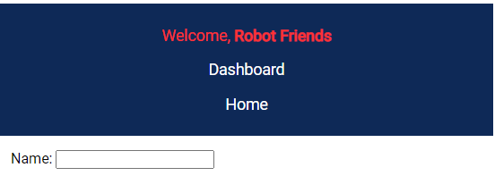

A Navbar sample using html, css and javascript.
Interactive - type in your name or any text into the input field and it shows on the Navbar
Text clears after input ready for re-use.
Query selectors, event listener, css styling with hover and text color change
Styled to fit desktop, mobile, tablet devices.

Navbar Sample desktop full width:
---------------------------------

Navbar with red highlight hover:
----------------------------------

Navbar optimized for mobile device:
-----------------------------------

